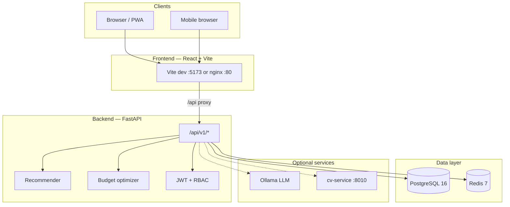

# PerX — Employee Benefits Platform

PerX is an AI-native, three-sided employee benefits marketplace. Employees browse and select perks within a company budget, employers approve selections and manage org settings, and providers list services on the marketplace. The stack includes a hybrid recommendation engine, optional local LLM chat (Ollama), computer-vision perks discovery, and a Progressive Web App (PWA) with offline-friendly caching.

---

## Table of contents

1. [Features](#features)
2. [Architecture](#architecture)
3. [Tech stack](#tech-stack)
4. [Project structure](#project-structure)
5. [Prerequisites](#prerequisites)
6. [First-time setup](#first-time-setup)
7. [How to run the project](#how-to-run-the-project)
   - [Option A — Recommended local development](#option-a--recommended-local-development)
   - [Option B — Full Docker dev stack](#option-b--full-docker-dev-stack)
   - [Option C — Backend without Docker](#option-c--backend-without-docker)
   - [Option D — LAN demo (phone on same Wi‑Fi)](#option-d--lan-demo-phone-on-same-wi-fi)
   - [Option E — Public demo (any network / judges)](#option-e--public-demo-any-network--judges)
   - [Option F — Production stack](#option-f--production-stack)
8. [Demo accounts](#demo-accounts)
9. [Environment variables](#environment-variables)
10. [Verification checklist](#verification-checklist)
11. [Testing](#testing)
12. [Troubleshooting](#troubleshooting)
13. [Further documentation](#further-documentation)

---

## Features

| Portal | Role | Highlights |
|--------|------|------------|
| **Employee** | `employee` | Onboarding quiz, perk explore, packages, selections, budget ring, wishlist, achievements, AI chat, vision-based discovery |
| **Employer** | `employer` | Approval queue, org analytics, employee management, invite codes |
| **Provider** | `provider` | Perk listings, performance analytics |

**Platform capabilities**

- JWT authentication with refresh tokens and Redis-backed revocation
- Hybrid recommender: cold-start rules → warm ML (content + collaborative filtering + UCB)
- Budget optimizer (PuLP knapsack) for multi-perk plan optimization
- Optional Ollama LLM for chat (template fallback when unavailable)
- CV microservice for lifestyle, receipt, OCR, catalog tagging, and visual search
- PWA with service worker and network-first API caching for key employee routes
- Albanian UI (`sq-AL`); AI chat prompts remain in English

---

## Architecture



**Request flow (development):** The browser talks to Vite on port **5173**. API calls go to `/api/v1/...` on the same origin; Vite proxies them to the FastAPI backend on port **8000**. Leave `VITE_API_URL` empty in dev so this proxy is used.

---

## Tech stack

| Layer | Technologies |
|-------|--------------|
| **Frontend** | React 18, TypeScript 5, Vite 5, Tailwind CSS, Framer Motion, Zustand, TanStack Query, vite-plugin-pwa |
| **Backend** | Python 3.11+, FastAPI, Pydantic v2, SQLAlchemy 2.0 (async), Alembic |
| **Data** | PostgreSQL 16, Redis 7 |
| **ML / AI** | scikit-surprise, implicit, LightGBM, PuLP, Ollama (optional) |
| **CV** | FastAPI microservice, OpenCV, Tesseract (in Docker) |
| **Infra** | Docker Compose, Traefik (optional), Cloudflare Tunnel (public demos) |

---

## Project structure

```
PerX/
├── backend/           # FastAPI API, services, Alembic migrations, tests
├── frontend/          # React PWA (employee / employer / provider portals)
├── cv-service/        # Computer vision microservice
├── database/          # SQL migrations (applied on first Postgres startup)
├── infra/             # Docker Compose files, Traefik config
├── docs/              # API contract, PRPs, architecture notes
├── scripts/           # Helper scripts (e.g. Windows firewall for LAN)
├── .env.example       # Environment template — copy to .env
└── README.md          # This file
```

| Path | README |
|------|--------|
| `backend/README.md` | API overview, env vars, tests |
| `frontend/README.md` | Vite scripts, PWA, i18n |
| `infra/README.md` | Compose profiles, LAN, Cloudflare tunnel |
| `cv-service/README.md` | Vision tasks and integration |
| `docs/api-contract.md` | Full REST API reference |

---

## Prerequisites

Install the following before running PerX:

| Tool | Version | Purpose |
|------|---------|---------|
| [Docker Desktop](https://www.docker.com/products/docker-desktop/) | Latest | Postgres, Redis, backend, cv-service |
| [Node.js](https://nodejs.org/) | 20+ | Frontend dev server and build |
| [Git](https://git-scm.com/) | Any | Clone the repository |

**Optional**

| Tool | Purpose |
|------|---------|
| Python 3.11+ | Run backend or cv-service outside Docker |
| [cloudflared](https://developers.cloudflare.com/cloudflare-one/connections/connect-apps/install-and-setup/installation/) | Public HTTPS demo URL (`winget install Cloudflare.cloudflared`) |
| Ollama | Local LLM for chat (`docker compose --profile with-ollama`) |

**OS notes**

- Commands below use **PowerShell** on Windows. On macOS/Linux, replace `copy` with `cp` and adjust path separators.
- On Windows, allow inbound port **5173** (and optionally **8000**) in the firewall for LAN access — see [Option D](#option-d--lan-demo-phone-on-same-wi-fi).

---

## First-time setup

Run these steps once after cloning the repository.

### Step 1 — Clone and enter the repo

```powershell
git clone <repository-url> PerX
cd PerX
```

### Step 2 — Create environment file

```powershell
copy .env.example .env
```

Edit `.env` at the repo root. Minimum changes for local development:

| Variable | Dev recommendation |
|----------|-------------------|
| `JWT_SECRET` | Long random string (e.g. `openssl rand -hex 32`) |
| `POSTGRES_PASSWORD` | Strong password (used when Docker creates the DB **on first run**) |
| `ALLOW_DEMO_MODE` | `true` for demos and hackathons |
| `VITE_API_URL` | Leave **empty** in development |

> **Important:** Postgres stores the password from the **first** `docker compose up`. If you change `POSTGRES_PASSWORD` later, either reset the Docker volume or update the password inside Postgres manually.

### Step 3 — Start Docker services

```powershell
cd infra
docker compose -f docker-compose.yml -f docker-compose.dev.yml up --build -d
```

This starts **PostgreSQL**, **Redis**, **backend** (port 8000), and **cv-service** (port 8010).

### Step 4 — Apply migrations and seed demo data

First run only:

```powershell
docker compose -f docker-compose.yml -f docker-compose.dev.yml exec backend alembic upgrade head
docker compose -f docker-compose.yml -f docker-compose.dev.yml exec backend python -m scripts.seed
```

### Step 5 — Install frontend dependencies

```powershell
cd ..\frontend
npm install
```

### Step 6 — Verify backend health

```powershell
curl http://localhost:8000/api/v1/health
```

Expected response includes `"status":"ok"`.

---

## How to run the project

Choose **one** backend mode. Do **not** run Docker backend and a separate local `uvicorn` on port 8000 at the same time — that causes login failures and unpredictable routing.

---

### Option A — Recommended local development

Best for day-to-day coding: Docker for data services + backend, Vite on the host for hot reload.

**Terminal 1 — Backend stack (leave running)**

```powershell
cd infra
docker compose -f docker-compose.yml -f docker-compose.dev.yml up
```

**Terminal 2 — Frontend**

```powershell
cd frontend
npm run dev
```

**Open in browser:** [http://localhost:5173](http://localhost:5173)

| Service | URL |
|---------|-----|
| Frontend | http://localhost:5173 |
| API (direct) | http://localhost:8000 |
| Swagger UI | http://localhost:8000/docs |
| cv-service | http://localhost:8010/health |

---

### Option B — Full Docker dev stack

Runs everything in containers, including Vite inside Docker (port 5173).

```powershell
cd infra
docker compose -f docker-compose.yml -f docker-compose.dev.yml --profile dev-frontend up --build
```

Open [http://localhost:5173](http://localhost:5173). No separate `npm run dev` needed.

---

### Option C — Backend without Docker

Requires local PostgreSQL 16 and Redis 7, or only the DB containers from Compose.

1. Ensure Postgres is reachable at `localhost:5432` with credentials matching `.env`.
2. Set `POSTGRES_HOST=localhost` in `.env`.
3. Run migrations and seed from `backend/`:

```powershell
cd backend
pip install -r requirements.txt
alembic upgrade head
python -m scripts.seed
uvicorn app.main:app --reload --host 0.0.0.0 --port 8000
```

4. In another terminal, start the frontend:

```powershell
cd frontend
npm run dev
```

> When using local `uvicorn`, ensure it loads the **repo root** `.env` (same `POSTGRES_*` values as Docker). Running from `backend/` without those variables defaults to `perx_secret`, which will not match a Docker Postgres volume created with a different password.

---

### Option D — LAN demo (phone on same Wi‑Fi)

Share PerX with a phone or tablet on the same network.

1. Start the stack (Option A or B).
2. Start Vite bound to all interfaces:

```powershell
cd frontend
npm run dev:lan
```

3. Find your PC’s LAN IP:

```powershell
ipconfig
```

Use the **IPv4 Address** under your Wi‑Fi adapter (e.g. `192.168.1.42` or `10.10.8.4`).

4. On the phone, open:

```
http://<YOUR-LAN-IP>:5173
```

Do **not** use `localhost` on the phone — that refers to the phone itself.

5. **Windows firewall** (PowerShell as Administrator, from repo root):

```powershell
.\scripts\open-lan-firewall.ps1
```

6. Verify from your PC before testing the phone:

```powershell
curl http://<YOUR-LAN-IP>:5173
curl http://<YOUR-LAN-IP>:5173/api/v1/health
```

**CORS:** With `ALLOW_DEMO_MODE=true`, the backend automatically accepts any private LAN IP (`10.x`, `192.168.x`, `172.16–31.x`) and `*.trycloudflare.com`. You do **not** need to edit `CORS_ORIGINS` when your Wi‑Fi IP changes.

---

### Option E — Public demo (any network / judges)

Expose PerX over HTTPS so anyone can open it from cellular, hotel Wi‑Fi, or a judge’s laptop — no LAN IP required.

**Keep three processes running on your laptop:**

| Terminal | Command |
|----------|---------|
| 1 | `cd infra` → `docker compose -f docker-compose.yml -f docker-compose.dev.yml up` |
| 2 | `cd frontend` → `npm run dev:lan` |
| 3 | `cloudflared tunnel --url http://localhost:5173` |

After starting `cloudflared`, copy the URL from the log line:

```
https://something-random.trycloudflare.com
```

Share that HTTPS link. The frontend is configured to accept `*.trycloudflare.com` hostnames, and demo-mode CORS allows tunnel origins automatically.

**Verify before sharing:**

```powershell
curl https://YOUR-SUBDOMAIN.trycloudflare.com/api/v1/health
```

Open the URL in a browser and log in with a [demo account](#demo-accounts).

**Notes**

- Quick tunnel URLs **change every time** you restart `cloudflared`.
- Your laptop must stay on and connected to the internet during the demo.
- Do **not** run a second backend on port 8000 alongside Docker.
- For a production-like single-port setup (nginx on port 80), see `infra/README.md` → Cloudflare Tunnel section.

---

### Option F — Production stack

Production nginx frontend on port 80, hardened defaults, restart policies, healthchecks.

```powershell
cd infra
copy ..\.env.example ..\.env
# Edit .env: ALLOW_DEMO_MODE=false, strong JWT_SECRET, POSTGRES_PASSWORD, INTERNAL_API_KEY

docker compose --env-file ../.env -f docker-compose.prod.yml up --build -d
```

Verify:

```powershell
curl http://localhost/api/v1/health
curl http://localhost/
```

Optional Traefik TLS:

```powershell
docker compose --env-file ../.env -f docker-compose.prod.yml --profile with-traefik up --build -d
```

See `infra/README.md` for full production notes.

---

## Demo accounts

All seeded demo users share the password **`Demo1234`**.

| Email | Role | Use case |
|-------|------|----------|
| `john.cold@example.com` | Employee | Cold-start recommender demo |
| `mira.warm@example.com` | Employee | Warm recommender demo |
| `hr@example.com` | Employer | Approvals and org dashboard |
| `flowfit@example.com` | Provider | Fitness provider portal |
| `greenbite@example.com` | Provider | Food provider portal |

Employer invite code for registration: **`ACME-DEMO`**

Reset demo passwords anytime:

```powershell
cd infra
docker compose -f docker-compose.yml -f docker-compose.dev.yml exec backend python -m scripts.seed
```

---

## Environment variables

Copy from `.env.example`. Key variables:

| Variable | Description |
|----------|-------------|
| `JWT_SECRET` | HS256 signing secret — **required in production** |
| `POSTGRES_USER` / `POSTGRES_PASSWORD` / `POSTGRES_DB` | Docker Postgres credentials |
| `POSTGRES_HOST` | `localhost` for host backend; Docker sets `postgres` inside containers |
| `REDIS_URL` | Redis connection string |
| `CORS_ORIGINS` | JSON array of allowed browser origins |
| `ALLOW_DEMO_MODE` | `true` enables demo endpoints and relaxed CORS for LAN/tunnel |
| `INTERNAL_API_KEY` | Protects `/internal/*` routes |
| `CV_ENABLED` | Enable vision jobs via cv-service |
| `CV_SERVICE_URL` | cv-service base URL |
| `OLLAMA_BASE_URL` / `OLLAMA_MODEL` | Optional local LLM |
| `VITE_API_URL` | Leave empty in dev; set for production frontend builds |

Full tables: `backend/README.md` and `backend/app/config.py`.

---

## Verification checklist

Use this before a demo or presentation:

- [ ] `curl http://localhost:8000/api/v1/health` → `"status":"ok"`
- [ ] `curl http://localhost:5173/api/v1/health` → `"status":"ok"` (via Vite proxy)
- [ ] Login at `/login` with `john.cold@example.com` / `Demo1234`
- [ ] Employee home loads at `/employee`
- [ ] Only **one** process listens on port 8000 (Docker **or** local uvicorn, not both)
- [ ] For public demo: tunnel URL loads and login works on a phone with Wi‑Fi disabled

Check port usage:

```powershell
netstat -ano | findstr ":8000 :5173"
```

---

## Testing

**Backend**

```powershell
cd backend
pytest tests/ -v
```

Requires Postgres with schema applied (`alembic upgrade head`).

**Frontend**

```powershell
cd frontend
npm run test:run
```

**cv-service**

```powershell
cd cv-service
pytest -q
```

---

## Troubleshooting

### "An unexpected error occurred" on login

Usually a backend database connection failure. Check Docker backend logs:

```powershell
cd infra
docker compose -f docker-compose.yml -f docker-compose.dev.yml logs backend --tail 50
```

Common causes:

- **Two backends on port 8000** — stop local `uvicorn` if Docker backend is running.
- **Postgres password mismatch** — local uvicorn used default `perx_secret` while Docker Postgres was created with a different `POSTGRES_PASSWORD`. Use one backend only, or align credentials.

### Phone cannot reach `http://<LAN-IP>:5173`

- Confirm `npm run dev:lan` is running and Vite prints a **Network** URL.
- Allow port **5173** in Windows Firewall (`scripts/open-lan-firewall.ps1`).
- Phone must be on the same Wi‑Fi (not guest/isolated network).

### Cloudflare tunnel shows "Blocked request" / host not allowed

The Vite dev server must allow tunnel hostnames. This repo sets `allowedHosts: ['.trycloudflare.com']` in `frontend/vite.config.ts`. Restart `npm run dev:lan` after config changes.

### "Too many requests" on login

Auth routes are rate-limited (5 login attempts per minute). Wait 60 seconds and retry.

### Postgres `password authentication failed`

The Postgres Docker volume keeps the password from **first initialization**. Either:

- Use the same `POSTGRES_PASSWORD` as when the volume was created, or
- Reset the volume (destroys data):

```powershell
cd infra
docker compose -f docker-compose.yml -f docker-compose.dev.yml down -v
docker compose -f docker-compose.yml -f docker-compose.dev.yml up --build -d
docker compose -f docker-compose.yml -f docker-compose.dev.yml exec backend alembic upgrade head
docker compose -f docker-compose.yml -f docker-compose.dev.yml exec backend python -m scripts.seed
```

### API works on localhost but not through LAN IP

Ensure `VITE_API_URL` is **empty** so the browser uses the same origin and Vite proxies `/api` to the backend.

---

## Further documentation

| Document | Contents |
|----------|----------|
| [`docs/api-contract.md`](docs/api-contract.md) | Complete REST API reference |
| [`docs/CLAUDE.md`](docs/CLAUDE.md) | Architecture rules and conventions |
| [`infra/README.md`](infra/README.md) | Docker Compose profiles, LAN, Cloudflare |
| [`backend/README.md`](backend/README.md) | Backend services and env vars |
| [`frontend/README.md`](frontend/README.md) | Frontend scripts and PWA |
| [`cv-service/README.md`](cv-service/README.md) | Vision pipelines |

---

## License

See repository license file if present. Demo credentials and `ALLOW_DEMO_MODE` must be disabled before any production deployment.
